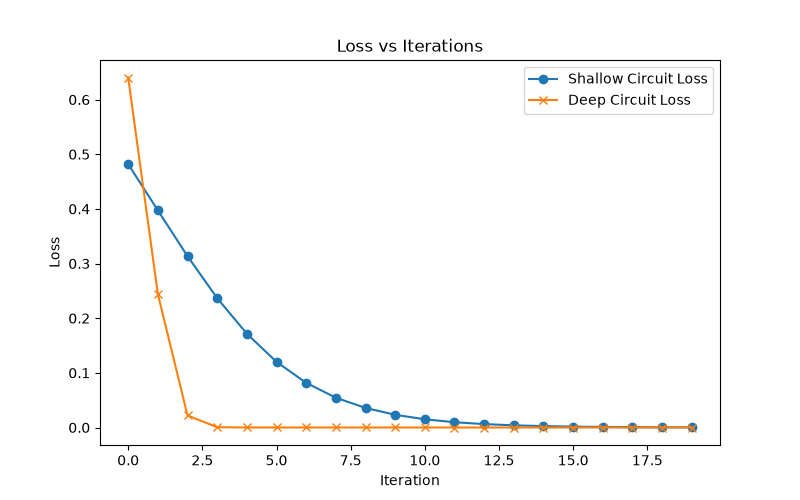

# Quantum Barren Plateaus: Effect of Circuit Depth

## 🎯 Challenge
How does circuit depth affect barren plateaus in quantum neural networks?

Quantum machine learning models often suffer from the "barren plateau" problem, where gradients vanish during training. This makes optimization extremely difficult. We investigate whether increasing the depth of a quantum circuit increases the likelihood of encountering barren plateaus.

## 💡 Hypothesis
Deeper circuits → higher chance of vanishing gradients.  
We expect shallow circuits to show stable gradients, while deeper circuits will lead to vanishing gradients, making training ineffective.

## ⚙️ Approach
- Built parameterized quantum circuits with 2–3 qubits.  
- Compared shallow (2 layers) vs. deep (6 layers) circuits.  
- Defined cost function as expectation value of Z operator on final qubit.  
- Trained circuits using gradient descent for 20 iterations.  
- Recorded loss values and gradient magnitudes.  
- Visualized results with plots.

## 🛠️ Methods and Tools
- **Frameworks**: Python, Qiskit, Matplotlib  
- **Backend**: Statevector simulator (Qiskit Aer)  
- **Optimization**: Gradient descent with learning rate 0.1  
- **Data**: Loss values and gradient magnitudes over 20 iterations

## 📊 Results

- Shallow circuit: Loss decreases steadily, gradients remain stable.  
- Deep circuit: Loss stagnates, gradients vanish quickly.  
- Confirms barren plateau phenomenon.

## 🚧 Limitations
- Small qubit count (2–3 qubits).  
- Simulated backend only, not real quantum hardware.  
- Limited iterations (20) for demonstration.

## 🔮 Next Steps
- Extend to larger qubit systems.  
- Test hybrid quantum-classical models.  
- Explore parameter initialization strategies to mitigate barren plateaus.

## 👥 Team Contributions
- **Likhita**: Circuit design, coding, experiments.  
- **Nikhil**: Data collection, plotting, analysis.  
- **Tridib**: Setup, README writing, final submission.  

---
